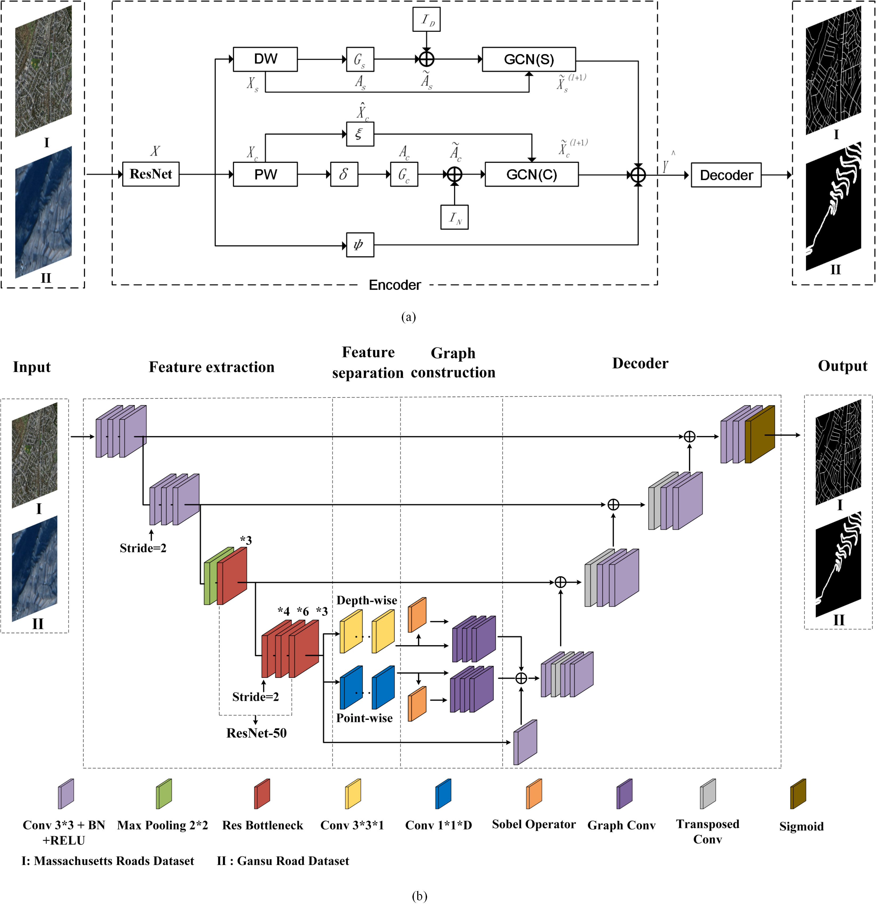

# SGCN
Split Depth-wise Separable Graph Convolution Network for Road Extraction in Complex Environment from High-resolution Remote Sensing Imagery

Gaodian Zhou, Weitao Chen, Qianshan Gui, Xianju Li and Lizhe Wang,[Split Depth-wise Separable Graph Convolution Network for Road Extraction in Complex Environment from High-resolution Remote Sensing Imagery](https://ieeexplore.ieee.org/document/9614130)(IEEE TGRS, 2021)

## quick start
### requirements
python 3.6 CUDA10.1 GPU:2080Ti*1

pytorch==1.1.0
tqdm==4.49.0
Pillow==6.1.0
opencv-python==4.1.0.25
### parameters
You can change epoch，batch_size，lr and decay in train_config.json
### train
1.Download the files mentioned in "dataset/gansu/readme"  
2.python3 main.py  

It will create a folder, named 'logs', and a log file. This log file will record the training process. 

And the trained model, with maximum OA in validation set, will be saved in a folder, named 'saved', and record the epoch num in 'best_epoch.txt' when saving the model. 
### eval
1.python3 eval.py  

It will evalute this model in test dataset, and print the metrics, including OA, IOU, precision, recall, F1, then save the confusion matrix in 'saved' folder.
### perdict
1.python3 predict.py  

You can find the visual results in 'predict/gansu/'，grays value of roads in 'vis' is 255 ，while 1 in 'mask'.

## cite
    @ARTICLE{9614130,
    author={Zhou, Gaodian and Chen, Weitao and Gui, Qianshan and Li, Xianju and Wang, Lizhe},
    journal={IEEE Transactions on Geoscience and Remote Sensing}, 
    title={Split Depth-wise Separable Graph-Convolution Network for Road Extraction in Complex Environments from High-resolution Remote-Sensing Images}, 
    year={2021},
    volume={},
    number={},
    pages={1-1},
    doi={10.1109/TGRS.2021.3128033}}

